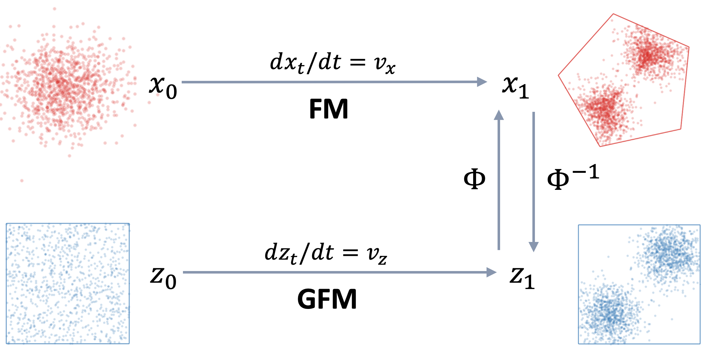

# Gauge Flow Matching over Constrained Domain

This repository contains examples used in
[Gauge Flow Matching for Efficient Constrained Generative Modeling over General Convex Set](https://openreview.net/forum?id=QyIlskgko9)



## Installation and Running

### Install Environment

Create conda environment using the following command:

```shell
conda env create -f environment.yml
```

Then activate the new environment:

```shell
conda activate gfm
```

### Run Examples

To train and test the model, please run the scripts under the `scripts` directory.

## References

[1] Lipman, Y., Chen, R. T., Ben-Hamu, H., Nickel, M., & Le, M. (2022). Flow matching for generative modeling. arXiv
preprint arXiv:2210.02747.

[2] Chen, R. T. torchdiffeq. (2018). https://github.com/rtqichen/torchdiffeq

[3] Xie, Tianyu, Yu Zhu, Longlin Yu, Tong Yang, Ziheng Cheng, Shiyue Zhang, Xiangyu Zhang, and Cheng Zhang. 2024.
Reflected Flow Matching. In Proceedings of the Forty-first International Conference on Machine Learning (ICML 2024).

---

If you find this repository useful in your research, please consider citing:

```
@inproceedings{
    li2026gauge,
    title={Gauge Flow Matching: Efficient Constrained Generative Modeling over General Convex Set and Beyond},
    author={Xinpeng Li and Enming Liang and Minghua Chen},
    booktitle={The Fourteenth International Conference on Learning Representations},
    year={2026},
    url={https://openreview.net/forum?id=vxq1OnaAMq}
}

@inproceedings{
    li2025gauge,
    title={Gauge Flow Matching for Efficient Constrained Generative Modeling over General Convex Set},
    author={Xinpeng Li and Enming Liang and Minghua Chen},
    booktitle={ICLR 2025 Workshop on Deep Generative Model in Machine Learning: Theory, Principle and Efficacy},
    year={2025},
    url={https://openreview.net/forum?id=QyIlskgko9}
}
```